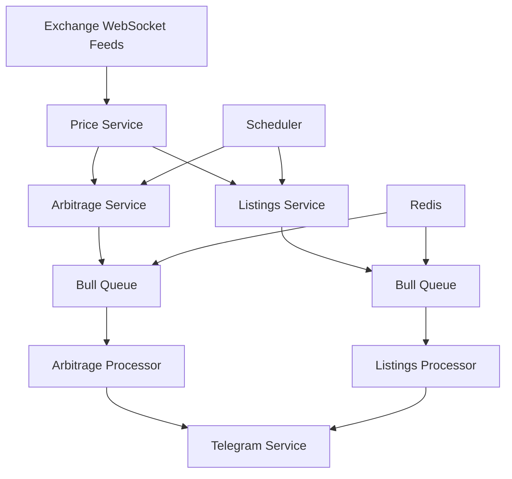

# 🤖 Futures Arbitrage Bot - Technical Description

## 📋 Overview

The Futures Arbitrage Bot is a sophisticated real-time trading opportunity detection system built with NestJS. It monitors cryptocurrency futures markets across multiple exchanges, identifies profitable arbitrage opportunities, and provides instant notifications via Telegram. The system is designed for high-frequency data processing, reliability, and scalability.

---

## 🏗️ Architecture Overview

### Core Components



### Technology Stack

- **Backend Framework**: NestJS (Node.js)
- **Queue System**: Bull + Redis
- **WebSocket Client**: ws library
- **Scheduler**: @nestjs/schedule
- **Notifications**: Telegram Bot API
- **Language**: TypeScript
- **Container**: Docker + Docker Compose

---

## 🔄 Data Flow Architecture

### 1. Real-time Price Collection

```typescript
WebSocket Connections → Price Parsing → Validation → Storage → Distribution
```

**Process:**
1. **WebSocket Connections**: Each exchange service maintains persistent WebSocket connections
2. **Price Parsing**: Incoming messages are parsed according to each exchange's format
3. **Data Validation**: Prices are validated for NaN, null, and negative values
4. **In-Memory Storage**: Valid prices are stored in Map data structures
5. **Event Distribution**: Price updates trigger downstream processing

### 2. Arbitrage Detection Pipeline

```typescript
Price Comparison → Opportunity Calculation → Validation → Queue Processing → Notification
```

**Process:**
1. **Scheduled Comparison**: Every 10 seconds, all price pairs are compared
2. **Opportunity Calculation**: Mathematical analysis of price differences
3. **Validation**: Threshold, profit, and cooldown checks
4. **Queue Processing**: Valid opportunities are queued for processing
5. **Notification**: Telegram alerts are sent for confirmed opportunities

### 3. New Listings Detection

```typescript
Symbol Fetching → Cross-Exchange Comparison → New Listing Detection → Alert Generation
```

**Process:**
1. **Symbol Fetching**: Regular API calls to fetch available trading symbols
2. **Cross-Exchange Comparison**: Compare symbols across all exchanges
3. **New Listing Detection**: Identify recently added symbols
4. **Alert Generation**: Generate notifications for new listings with arbitrage potential

---

## 🧩 Detailed Component Analysis

### Exchange Services

#### Purpose
Each exchange service manages WebSocket connections and API interactions for a specific exchange.

#### Supported Exchanges
- **Binance**: `wss://fstream.binance.com/ws/`
- **ByBit**: `wss://stream.bybit.com/v5/public/linear`
- **MEXC**: `wss://contract.mexc.com/edge`
- **Gate.io**: `wss://fx-ws.gateio.ws/v4/ws/usdt`
- **LBank**: `wss://www.lbkex.net/ws/V2/`

#### Key Functions
```typescript
// WebSocket subscription to price feeds
async subscribeToTicker(symbol: string, callback: (data: PriceData) => void)

// Fetch available trading symbols
async getSymbols(): Promise<ExchangeSymbol[]>

// Connection management
async initialize()
async disconnect()
```

#### Error Handling
- **Automatic Reconnection**: Implements exponential backoff
- **Connection Monitoring**: Tracks connection state and health
- **Data Validation**: Filters invalid price data (NaN, null, negative)

### Price Service

#### Purpose
Central hub for price data aggregation, storage, and distribution.

#### Data Structure
```typescript
interface PriceData {
    symbol: string;        // Trading pair (e.g., "BTC/USDT")
    price: number;         // Current price
    exchange: string;      // Exchange name
    timestamp: number;     // Unix timestamp
    volume?: number;       // 24h volume
    high?: number;         // 24h high
    low?: number;          // 24h low
}
```

#### Storage Strategy
- **In-Memory Maps**: Fast access for real-time processing
- **Price History**: Maintains last 100 prices per symbol/exchange
- **Stale Data Detection**: Marks prices older than 60 seconds as stale
- **Cleanup Mechanism**: Removes old data every 5 minutes

#### Key Functions
```typescript
// Update price data
updatePrice(priceData: PriceData): void

// Retrieve prices for specific symbol
getAllPricesForSymbol(symbol: string): PriceData[]

// Check if price is stale
isPriceStale(symbol: string, exchange: string): boolean

// Cleanup old data
cleanupOldPrices(): void
```

### Arbitrage Service

#### Purpose
Detect and process arbitrage opportunities across exchanges.

#### Detection Logic

```typescript
// Opportunity detection algorithm
for each trading pair:
    1. Get all fresh prices for the pair
    2. Compare every exchange pair combination
    3. Calculate price difference percentage
    4. Validate against thresholds
    5. Check cooldown period
    6. Queue valid opportunities
```

#### Opportunity Calculation
```typescript
interface ArbitrageOpportunity {
    symbol: string;                    // Trading pair
    exchangeA: string;                 // First exchange
    exchangeB: string;                 // Second exchange
    priceA: number | null;             // Price on exchange A
    priceB: number | null;             // Price on exchange B
    priceDifference: number | null;    // Absolute price difference
    priceDifferencePercent: number | null; // Percentage difference
    profit: number | null;             // Estimated profit
    action: 'BUY_A_SELL_B' | 'BUY_B_SELL_A' | 'INVALID';
    timestamp: number;                 // Detection timestamp
}
```

#### Mathematical Formulas
```typescript
// Price difference calculation
priceDifference = Math.abs(priceA - priceB)

// Percentage difference
avgPrice = (priceA + priceB) / 2
priceDifferencePercent = (priceDifference / avgPrice) * 100

// Profit estimation (simplified)
profit = priceDifference * tradeSize
```

#### Validation Rules
1. **Threshold Check**: `priceDifferencePercent >= config.thresholdPercent`
2. **Profit Check**: `profit >= config.minProfitUsd`
3. **Cooldown Check**: No alert sent for same pair within cooldown period
4. **Data Validity**: All price values must be valid numbers

#### Configuration
```typescript
interface ArbitrageConfig {
    thresholdPercent: number;    // Minimum price difference (default: 0.7%)
    cooldownMinutes: number;     // Alert cooldown (default: 5 minutes)
    tradingPairs: string[];      // Monitored pairs
    minProfitUsd: number;        // Minimum profit (default: $10)
}
```

### Listings Service

#### Purpose
Monitor and detect new cryptocurrency listings across exchanges.

#### Detection Strategy
1. **Regular Symbol Fetching**: Every 30 minutes, fetch all available symbols
2. **Cross-Exchange Comparison**: Compare symbol availability across exchanges
3. **New Listing Identification**: Detect symbols that appeared within threshold time
4. **Arbitrage Potential Analysis**: Check if new listings have arbitrage opportunities

#### Data Structure
```typescript
interface NewListing {
    symbol: string;           // Trading pair
    baseAsset: string;        // Base currency
    quoteAsset: string;       // Quote currency
    exchange: string;         // Exchange name
    listingTime: number;      // When it was listed
    status: string;           // Trading status
    isNewListing: boolean;    // New listing flag
    firstPrice?: number;      // Initial price
    volume24h?: number;       // 24h volume
}
```

### Queue System (Bull + Redis)

#### Purpose
Reliable, scalable job processing for arbitrage and listing alerts.

#### Queue Configuration
```typescript
// Arbitrage queue
@InjectQueue('arbitrage') private arbitrageQueue: Queue

// Listings queue  
@InjectQueue('listings') private listingsQueue: Queue
```

#### Job Processing
- **Priority**: Based on arbitrage percentage (higher % = higher priority)
- **Retry Logic**: Up to 3 attempts for failed jobs
- **Concurrency**: Multiple jobs processed simultaneously
- **Error Handling**: Failed jobs are logged and retried

### Telegram Service

#### Purpose
Deliver real-time notifications and alerts to users.

#### Alert Types
1. **Arbitrage Opportunities**: Detailed trading recommendations
2. **New Listings**: Alerts for newly listed cryptocurrencies
3. **System Status**: Bot health and error notifications
4. **Custom Messages**: Manual alerts and updates

#### Message Formatting
```typescript
// Arbitrage alert format
🚨 ARBITRAGE OPPORTUNITY 🚨
📊 Pair: BTC/USDT
📈 Spread: 1.25%
💰 Potential Profit: $1,250.00
🔄 Action:
   🟢 BUY on binance: $43,250.00
   🔴 SELL on bybit: $43,790.00
```

#### Error Handling
- **Graceful Degradation**: Logs messages if Telegram is unavailable
- **Retry Mechanism**: Automatic retry for failed message sends
- **Validation**: Validates message data before formatting

---

## 🔧 Error Handling & Resilience

### WebSocket Connection Management

#### Connection States
- **CONNECTING**: Initial connection attempt
- **OPEN**: Active connection receiving data
- **CLOSING**: Graceful disconnect in progress
- **CLOSED**: Connection terminated

#### Reconnection Logic
```typescript
// Exponential backoff strategy
baseDelay = 5000ms
maxDelay = 60000ms
attempt = 0

reconnectDelay = Math.min(baseDelay * Math.pow(2, attempt), maxDelay)
```

#### Error Recovery
1. **Connection Drops**: Automatic reconnection with backoff
2. **Invalid Data**: Filter and log problematic messages
3. **Rate Limiting**: Respect exchange rate limits
4. **API Errors**: Graceful degradation and retry

### Data Validation

#### Price Data Validation
```typescript
// Comprehensive price validation
function isValidPrice(price: any): boolean {
    return price !== null && 
           price !== undefined && 
           typeof price === 'number' && 
           !isNaN(price) && 
           price > 0 && 
           price < Number.MAX_SAFE_INTEGER;
}
```

#### Arbitrage Opportunity Validation
```typescript
// Multi-layer validation
1. Data completeness check
2. Price validity verification
3. Threshold requirement validation
4. Profit calculation verification
5. Cooldown period check
```

### Queue Error Handling

#### Job Failure Management
- **Retry Logic**: Automatic retry with exponential backoff
- **Dead Letter Queue**: Failed jobs after max retries
- **Error Logging**: Detailed error tracking
- **Graceful Degradation**: Continue processing other jobs

---

## 📊 Performance Optimization

### Memory Management

#### Data Structure Optimization
- **Maps vs Objects**: Use Map for better performance
- **Circular Buffers**: Limit price history to prevent memory leaks
- **Garbage Collection**: Regular cleanup of stale data

#### Memory Usage Patterns
```typescript
// Price storage optimization
priceHistory: Map<string, PriceData[]> = new Map();
maxHistorySize = 100; // Limit per symbol/exchange

// Regular cleanup
cleanupInterval = 5 * 60 * 1000; // 5 minutes
```

### Processing Efficiency

#### Batch Processing
- **Bulk Operations**: Process multiple opportunities simultaneously
- **Parallel Processing**: Use Promise.all for concurrent operations
- **Queue Optimization**: Priority-based job processing

#### Caching Strategy
- **In-Memory Cache**: Fast access to frequently used data
- **Redis Cache**: Persistent storage for queue state
- **TTL Management**: Automatic expiration of stale data

---

## 🔍 Monitoring & Logging

### Logging Strategy

#### Log Levels
- **DEBUG**: Detailed price updates and internal operations
- **LOG**: General information and status updates
- **WARN**: Non-critical issues and validation failures
- **ERROR**: Critical errors requiring attention

#### Log Format
```typescript
// Structured logging with emojis
[Nest] 98561 - 07/06/2025, 12:22:31 AM DEBUG [ExchangeService] 💰 Price update: BTC/USDT on binance = $107971.8
[Nest] 98561 - 07/06/2025, 12:22:31 AM LOG [ArbitrageService] 🔍 Found 3 arbitrage opportunities
[Nest] 98561 - 07/06/2025, 12:22:31 AM WARN [ArbitrageService] ⚠️ Invalid price data: XRP/USDT - A: 2.2122, B: NaN
```

### Health Monitoring

#### System Health Checks
- **WebSocket Connections**: Monitor connection status
- **Price Data Freshness**: Check for stale data
- **Queue Status**: Monitor job processing health
- **Memory Usage**: Track memory consumption

#### API Endpoints
```typescript
GET /health        // Basic health check
GET /status        // Detailed system status
GET /prices        // Current price data
GET /arbitrage/stats // Arbitrage statistics
```

---

## 🚀 Deployment & Scaling

### Docker Configuration

#### Multi-Stage Build
```dockerfile
# Builder stage for compilation
FROM node:18-alpine AS builder
# Production stage for runtime
FROM node:18-alpine AS production
```

#### Container Orchestration
- **App Container**: Main application with health checks
- **Redis Container**: Queue and cache storage
- **Network Isolation**: Secure inter-container communication
- **Volume Persistence**: Data persistence across restarts

### Environment Configuration

#### Production Settings
```env
NODE_ENV=production
REDIS_HOST=redis
ARBITRAGE_THRESHOLD_PERCENT=0.7
COOLDOWN_MINUTES=5
TRADING_PAIRS=BTC/USDT,ETH/USDT,BNB/USDT
```

#### Scaling Considerations
- **Horizontal Scaling**: Multiple app instances with shared Redis
- **Load Balancing**: Distribute API requests across instances
- **Database Scaling**: Redis clustering for high availability
- **Resource Limits**: Memory and CPU constraints in production

---

## 📈 Future Enhancements

### Planned Features
1. **Machine Learning**: Price prediction and pattern recognition
2. **Risk Management**: Position sizing and exposure limits
3. **Backtesting**: Historical performance analysis
4. **Web Dashboard**: Real-time monitoring interface
5. **Advanced Arbitrage**: Cross-exchange portfolio management

### Technical Improvements
1. **Performance Optimization**: Further reduce latency
2. **Data Persistence**: Historical data storage
3. **Advanced Analytics**: Market trend analysis
4. **API Rate Limiting**: Smarter request management
5. **Security Enhancements**: API key rotation and encryption

---

## 🐛 Known Issues & Solutions

### Current Issues

#### ByBit WebSocket Data
**Problem**: ByBit returning NaN prices in WebSocket feeds
**Solution**: Enhanced data validation and error handling
**Status**: Fixed with robust null/NaN checking

#### MEXC Connection Issues
**Problem**: WebSocket connection errors (307 redirects)
**Solution**: Updated endpoint and message format
**Status**: Improved with better error handling

### Troubleshooting Guide

#### Common Problems
1. **No Price Updates**: Check WebSocket connections
2. **NaN Values**: Validate exchange message parsing
3. **Queue Stalls**: Restart Redis or check memory
4. **Telegram Failures**: Verify bot token and chat ID

#### Debugging Steps
```bash
# Check container status
docker-compose ps

# View application logs
docker-compose logs -f app

# Check Redis connection
docker-compose exec redis redis-cli ping

# Monitor resource usage
docker stats
```

---

## 📚 API Reference

### Price Endpoints
- `GET /prices` - All current prices
- `GET /prices/symbol/:symbol` - Prices for specific symbol
- `GET /prices/history/:symbol/:exchange` - Price history

### Arbitrage Endpoints
- `GET /arbitrage/opportunities` - Recent opportunities
- `GET /arbitrage/stats` - Performance statistics
- `POST /arbitrage/config` - Update configuration

### Listings Endpoints
- `GET /listings` - Recent new listings
- `GET /listings/exchange/:exchange` - Exchange-specific listings
- `POST /listings/force-check` - Manual listing check

### System Endpoints
- `GET /health` - Health check
- `GET /status` - System status
- `GET /` - Welcome message

---

*This documentation covers the complete technical implementation of the Futures Arbitrage Bot. For deployment instructions, see the main README.md file.* 